# 📝 Horizon Notes: Project Dashboard & Dashboard Control

> **Project Codename:** Hydrop  
> **Type:** Infinite Canvas Note-Taking App (Flutter)  
> **Design Language:** Neo-Skeuomorphic ("Tactile Blueprint")  
> **Status:** Active Sprint — Refinement & Mobile Fitting  

---

## ⚡ THE ACTIVE SPRINT
*These are the ONLY tasks currently authorized for active development. No new features may be coded until these are complete.*

- [x] **📁 Directory Restructuring:** Clean up root folder, relocate logs, history, and handoff documentation to dedicated subfolders.
- [x] **🗺️ Roadmap Synchronization:** Update [VISUAL_ROADMAP.md](file:///c:/Users/Silver/Downloads/silver-os/50_IDEAS/Apps/Horizon_Notes/VISUAL_ROADMAP.md) with recent implementations (Undo/Redo stack, soft-delete, and rename systems) and correct relative paths.
- [x] **💻 Desktop Layout & UI Polish:** Optimize toolbars, keyboard shortcuts, and mouse/trackpad interactions for desktop screens.
- [x] **🌐 Web Build Validation:** Ensure the Canvas Engine and Neo-Skeuomorphic components render correctly on Web.
- [ ] **📱 Mobile Layout & Responsive Check:** (Deferred) Run the app on mobile simulators/devices.

---

## 🪲 BUGS & ISSUES (INVESTIGATING)
*Log active bugs here. A bug must be resolved or stashed/rolled back before starting a new feature.*

- [ ] **💻 AXSpam (Desktop):** `ui::AXTree` console error spam in Windows debug output (Known Flutter engine bug related to TextFields).
- [ ] **📱 Mobile Interaction Deficit:** (Deferred) Drawing or interacting on touch-sensitive screens has alignment issues.

---

## 🔮 THE BACKLOG (FROZEN)
*Ideas, expansions, and post-MVP features. Write ideas here immediately. DO NOT write code for them until they are moved into an Active Sprint.*

### Technical & Engineering
- [ ] **Sync Engine:** Multiplayer sync using zero-server architecture (syncing direct to user's Google Drive or OneDrive).
- [ ] **AI Integration:** Local AI (Ollama) integration for smart connections and note synthesis.
- [ ] **3D Extrusion:** Pseudo 3D Extrusion (Phase 2 Canvas depth and camera tilt).
- [x] **SVG Support:** High-fidelity vector SVG path export capabilities.

### Monetization & User Experience
- [ ] **AdMob Integration:** AdMob banner/interstitial setup and rewarded video pass system.
- [ ] **Onboarding Flow:** 3-screen animated skeuomorphic onboarding flow.
- [x] **Export Options Panel:** Export configuration UI for PDF, PNG, and SVG vector options.

---

## 📈 14-Day Design Roadmap (Historical Timeline)
*This is the historical blueprint for the design phase completed in Stitch (Project: `Hydrop`, ID: `2628096570342319907`).*

```mermaid
gantt
    title 14-Day Design Timeline
    dateFormat  X
    axisFormat %d
    
    section Research
    Phase 1: Research & Discovery :active, 0, 2
    
    section IA & Structure
    Phase 2: Information Architecture : 2, 3
    Phase 3: Grayscale Wireframing : 3, 5
    
    section Design System
    Phase 4: Design System Setup : 5, 6
    
    section Hi-Fi Design
    Phase 5: High-Fidelity UI Design : 6, 11
    
    section Handoff
    Phase 6: Prototyping & Specs Handoff : 11, 14
```

### Phase 1: Research & Discovery (Days 1–2)
- [x] **Competitor Analysis**: Research Samsung Notes, Noteshelf, GoodNotes, and Notability. Focus on canvas navigation and page management. → See: [Competitive Analysis](file:///c:/Users/Silver/Downloads/silver-os/50_IDEAS/Apps/Horizon_Notes/01_Research_and_Discovery/Competitive_Analysis.md)
- [x] **Pain Point List**: Identify top 10 complaints in competitor app store reviews. → See: [Customer Reviews Deep Dive](file:///c:/Users/Silver/Downloads/silver-os/50_IDEAS/Apps/Horizon_Notes/01_Research_and_Discovery/Customer_Reviews_Deep_Dive.md)
- [x] **User Personas**: Student & Professional. → See: [User Personas](file:///c:/Users/Silver/Downloads/silver-os/50_IDEAS/Apps/Horizon_Notes/01_Research_and_Discovery/User_Personas.md)

### Phase 2: Information Architecture (Day 3)
- [x] Map every screen and user flow on paper or FigJam. → See: [User Flows](file:///c:/Users/Silver/Downloads/silver-os/50_IDEAS/Apps/Horizon_Notes/03_Design_and_UX/User_Flows.md)
- [x] Separate MVP requirements from v2 post-launch features.

### Phase 3: Wireframing (Days 4–5)
- [x] **Grayscale Rule**: Low-fidelity wireframes generated via Stitch.
- [x] **Canvas Focus**: Layout, tool placement, and horizontal page strip positioning.

### Phase 4: Design System Setup (Day 6)
- [x] **Color Palette**: Paper (`#F4F2EC`), Ink (`#2D2D2D`), Inset (`#E8E4D9`), Error (`#EF4444`).
- [x] **Tokens & Components**: Border radii, surface states (`raisedSurface`, `buttonDefault`, `buttonPressed`, `insetSurface`). Spec implemented in `lib/theme/theme.dart`.

### Phase 5: High Fidelity UI Design (Days 7–11)
- [x] High-fidelity layouts created.

### Phase 6: Prototype & Handoff (Days 12–14)
- [x] Developer handoff documentation created. → See: [Developer Handoff Guide](file:///c:/Users/Silver/Downloads/silver-os/50_IDEAS/Apps/Horizon_Notes/06_Architecture/Developer_Handoff.md)

---

## 📏 Core Canvas Design Rules
1. **Dockable Toolbar**: The Neo-Skeuomorphic toolbar (`raisedSurface` decoration) can be docked to any edge — left, right, top, or bottom. Active tools use `buttonPressed` (inset) state.
2. **Minimap**: A recessed (`insetSurface`) minimap provides real-time overview of canvas content and viewport position.
3. **Multi-Layer Support**: Users can work across multiple layers with per-layer visibility, managed via the Layers Panel.
4. **Split View**: Two canvases can be opened side-by-side for reference-while-drawing workflows.
5. **Neo-Skeuomorphic Surface Rules**: All floating UI uses `raisedSurface` (paper bg, 2px ink border, shadow). No glassmorphism, no backdrop blur.

---

## 🗂️ MVP Screens Checklist (Implemented & Verified)
- [x] Splash / Onboarding Screens
- [x] Sign In / Sign Up
- [x] Home / Notebooks List
- [x] Notebook Detail Layout
- [x] Note Canvas (Empty & Active Drawing States)
- [x] Floating Tool Palette (Pens, Eraser, Selection, Bounding Box, Undo/Redo)
- [x] Page Rotation UI & Page Settings Menu
- [x] Search Notes Overlay
- [x] Soft-Delete Trash System
- [x] Document Node & Connector Node Systems
- [x] Local Storage Hive Database Integration
