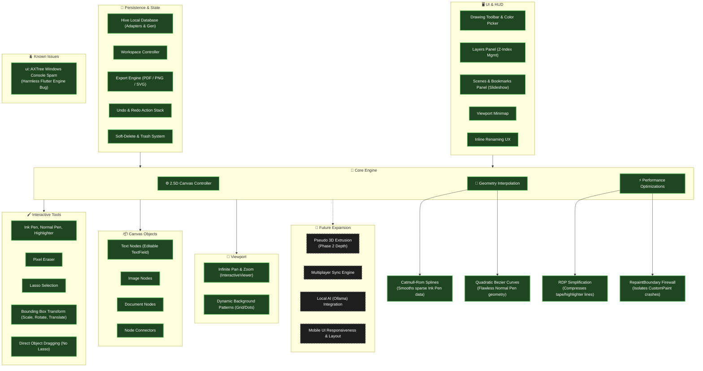

# 🌌 Horizon Notes Visual Roadmap

> **Legend:**
> 🟩 **Solid Green:** Built & Deployed
> 🟨 **Solid Yellow:** Active / In Progress
> 🟥 **Solid Red:** Known Bug / Blocked
> ⬛ **Dashed Gray:** Planned Future Feature

### 🗺️ The Architecture Board

### 🧠 Architectural Ledger (The 'Why')

If you forget why a system exists, click here to read its documentation:

- [Developer Handoff Guide](file:///c:/Users/Silver/Downloads/silver-os/50_IDEAS/Apps/Horizon_Notes/06_Architecture/Developer_Handoff.md) - Primary guide for code takeover, skeuomorphic theme parameters, and codebase checkpoints.
- [Architectural History](file:///c:/Users/Silver/Downloads/silver-os/50_IDEAS/Apps/Horizon_Notes/05_Session_Logs/HISTORY.md) - Chronological log of design pivots, engine selections, and system upgrades.
- [Phase 1: RDP Simplification](file:///c:/Users/Silver/Downloads/silver-os/50_IDEAS/Apps/Horizon_Notes/06_Architecture/2.5D_Canvas_Engine/Phase_1_RDP_Simplification.md) - Explains why we compress points from the highlighter tool to save RAM.
- [Phase 2: Pseudo 3D Extrusion](file:///c:/Users/Silver/Downloads/silver-os/50_IDEAS/Apps/Horizon_Notes/06_Architecture/2.5D_Canvas_Engine/Phase_2_Pseudo_3D_Extrusion.md) - The upcoming 3D tilt feature.
- **Catmull-Rom Interpolation (Ink Pen)** - Implemented to inject mathematical coordinates between sparse desktop mouse polling events, preventing jagged edges when drawing quickly without a stylus.
- **Quadratic Bezier Splines (Normal Pen)** - Implemented to bypass the complex polygon engine entirely for uniform pens, resulting in mathematically flawless curves regardless of hardware.
- **Undo / Redo System** - Implemented a memory-efficient action state stack storing canvas stroke, image, text, and connector deltas (capped at 50 steps) to allow error-free exploration.
- **Trash & Soft-Delete System** - Protects user data by adding an `isTrashed` flag to Hive models and displaying a dedicated Trash tab, preventing permanent deletion until requested.

*(This file will serve as your permanent visual anchor. Whenever we start a new feature or fix a bug, we will update this Mermaid diagram first so you can visually see the empire growing.)*
