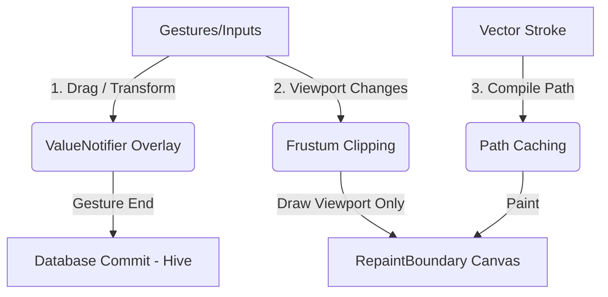

# ⚔️ Horizon Notes: Competitor Research & Technical Feasibility Report

> **Prepared by:** DAEDALUS (Chief Technology Officer)  
> **Date:** June 13, 2026  
> **Sprint Phase:** Phase 1 — Research & Discovery (Update)  
> **Status:** COMPLETE — Ready for Review

---

## 📱 Cross-Platform Architecture: Native & Web Optimization
To ensure the app does not lag on Android and Web, we leverage a single Flutter codebase (`lib/`) compiled to native machine code (ARM via Dart AOT) on Android/iOS, and WebAssembly (Wasm) on Web. 

### Cross-Device Code Reuse
Flutter compiles the same UI layouts, custom painters, and controller state management into native code for each target platform. The exact same vector drawing math and layout engines run on both PC and Android. However, mobile devices and web browsers are much more resource-constrained.

### How We Prevent Lag (The 5 Golden Rules)

1. **Two-Phase Interactive Transformations (Compliance Rule 3)**:
   - *The Lag Trap*: Mutating raw path coordinates inside the local database (Hive) at 120fps during a drag gesture will choke any mobile CPU.
   - *The Solution*: During gestures (Phase 1: Live Drag), only modify a lightweight `ValueNotifier<Rect>` bounding box. Render a temporary overlay using a dedicated `RepaintBoundary` and a simple rectangular painter. Commit the geometric math to the actual strokes/nodes in the DB only when the finger lifts (Phase 2: Commit).

2. **Visible Viewport Frustum Culling**:
   - *The Lag Trap*: Drawing 10,000 vector strokes on canvas when only 50 are visible on the screen.
   - *The Solution*: Intersect the bounding box of every stroke/node with the current viewport `Rect` (computed from current scroll offset and zoom scale). If it doesn't overlap, clip it and skip the paint call.

3. **Vector Path Caching**:
   - *The Lag Trap*: Converting a list of coordinate points into a Bezier `Path` on every paint cycle.
   - *The Solution*: Keep a cached `ui.Path` object inside each `Stroke` model. When rendering, paint the cached path. Only rebuild the path when `invalidateCache()` is called (e.g., when the stroke is edited or erased).

4. **RepaintBoundary Isolation**:
   - *The Lag Trap*: Re-painting the entire canvas because a sidebar menu is sliding in or out.
   - *The Solution*: Wrap the drawing canvas inside a `RepaintBoundary`. This instructs Flutter to cache the canvas rendering as a texture on the GPU. Unrelated UI animations (menus, toolbars) will animate on separate GPU layers without forcing the canvas to redraw.

5. **Wasm (WebAssembly) Compilation**:
   - Compiling the web build using `flutter build web --wasm` bypasses JS execution overhead and compiles the canvas math directly to native web instructions, achieving near-desktop performance on mobile web browsers.

---

## 🔍 The 2026 Competitor Feature Scrape

Expanding beyond the initial list (*Scenes, Tape, Connectors, Notion Blocks, and Clusters*), here are the most requested and innovative features from Heptabase, Muse, Concepts, and Apple Freeform:

### 1. Vector Slicing & Organical Nudging (Concepts Approach)
*   **The Feature**: Instead of deleting a whole stroke, a **Slice** tool acts like an X-Acto knife, cutting a drawn line into two independent vector strokes. A **Nudge** tool allows the user to push a vector line around dynamically, adjusting the curve organically without redrawing it.
*   **Tactile Vibe**: Dragging a needle tool over lines and watching them cleanly split or bend.
*   **Flutter Feasibility**: High. Since our strokes are list-based coordinates, slicing is a line-intersection check. If a slice line intersects a stroke segment, we split the stroke coordinate array into two separate `Stroke` objects.

### 2. Card-First Multi-Contextual Engine (Heptabase Approach)
*   **The Feature**: The canvas contains "Cards" (text, code, or checklists). Instead of these cards being tied to a single page, the underlying database treats them as global entities. A single card can reside on a "Mind Map Canvas," a "Daily Journal Page," and a "Project Board" at the same time. If you edit the card on one canvas, it instantly updates across all other canvases.
*   **Tactile Vibe**: Dragging cards out of a sidebar repository onto the current board.
*   **Flutter Feasibility**: Medium. We need to decouple our canvas item storage. Instead of storing canvas children *directly* in a `Workspace` model, the canvas holds a list of `CardID` references. The controller resolves these references against a global `CardRepository`.

### 3. Drag-and-Extract PDF Annotator (Heptabase / Muse Approach)
*   **The Feature**: The user drags a PDF document onto the canvas. It renders inline as a scrollable card. When they highlight text inside the PDF, they can drag that highlight *off* the document and drop it onto the canvas to create a new linked sticky note card.
*   **Tactile Vibe**: Dragging text highlights off a document page and watching them morph into notes on the desktop.
*   **Flutter Feasibility**: High. Using an inline PDF rendering package (e.g., `pdfrx`), we capture the drag-start gesture on text selection, spawn a temporary drag visual, and insert a new `TextNode` at the drop coordinate.

### 4. Direct Media Scrubbing & Web Previews (Muse Approach)
*   **The Feature**: Dragging web URLs or audio/video files onto the canvas. The cards render rich previews (YouTube thumbnails, page summaries). Audio and video cards have a built-in scrubbing strip, allowing the user to listen to audio lectures or watch clips directly in the canvas spatial layout without full-screen overlays.
*   **Tactile Vibe**: Rotating a knob on an audio node to scrub through a lecture recording.
*   **Flutter Feasibility**: High. YouTube embedding and rich HTML link parsing can be handled in controllers (`lib/controllers/link_preview_controller.dart`). Video scrubbing is rendered using a customized `VideoPlayer` inside the UI widget tree.

### 5. Instant Vector Alignment Grid (Concepts / Figma Approach)
*   **The Feature**: When dragging cards, text, or sketches, smart dynamic alignment lines (guides) snap the item to the edges or centers of nearby elements, displaying distance markers (e.g., `32px`).
*   **Tactile Vibe**: Seeing red alignment lines pop up and feel a subtle haptic snap as you align blocks.
*   **Flutter Feasibility**: High. In the controller's transform updates, we calculate the delta distance between the active item's bounds and all other visible elements on the canvas. If the distance falls under a threshold (e.g., 8px), we snap the coordinate and expose the coordinate guide to the painter.

---

## ⚖️ Strategic Comparison Matrix (Demiurge ROI Filter)

| Feature | Compelling Value | Coding Effort | Mobile Performance Cost | Launch Status |
| :--- | :--- | :--- | :--- | :--- |
| **Scenes / Bookmarks** | Perfect for infinite canvas navigation | 2-3 Days | Zero (Just camera updates) | **Recommend Phase 1** |
| **The Tape Tool** | High-utility student active-recall tool | 3-4 Days | Very Low (Basic clipping masks) | **Recommend Phase 1.5** |
| **PDF Annotation Drag** | Turn app into a deep research workstation | 5-7 Days | Medium (PDF rendering overhead) | **Recommend Phase 2** |
| **Spatial Connectors** | Essential for visual brainstorming | 6-8 Days | Low (Re-painting lines) | **Recommend Phase 2** |
| **Vector Slice / Nudge** | Pure tactile vector control | 10+ Days | High (Frequent coordinate checks) | **Recommend Phase 3** |
| **Global Cards Repository** | Dynamic second brain architecture | 8-10 Days | Zero (Database design shift) | **Recommend Phase 3** |

---

## 🚀 Recommended Roadmap: The Demiurge Filter In Action

To avoid the **Anesthesia Loop** (developing forever without shipping) while creating a world-class application, we propose this phased launch:

### Phase 1: MVP Core (Tactile Stability)
1. **Finish Sidebar Collapse / Polish** (Completed in last session).
2. **Implement PDF/Image Export Engine** (Essential for note utility).
3. **Build AdMob & Cloud Sync** (Sync ensures cross-device retention).
4. **Scenes / Bookmarks** (Add this first because it is highly visual, easy to implement, and resolves the "I'm lost on the canvas" issue).

### Phase 1.5: The Study Update (User Acquisition Hook)
- **Implement the Tape Tool**: Swiping to hide, tapping to reveal. This acts as our primary marketing hook on TikTok/Instagram targeting student productivity.

### Phase 2: The Collaboration & Research Update (Retention)
- **Spatial Connectors**: Connect nodes together.
- **Link Previews & PDF Annotation Drag**: Turn the canvas into a workstation.
